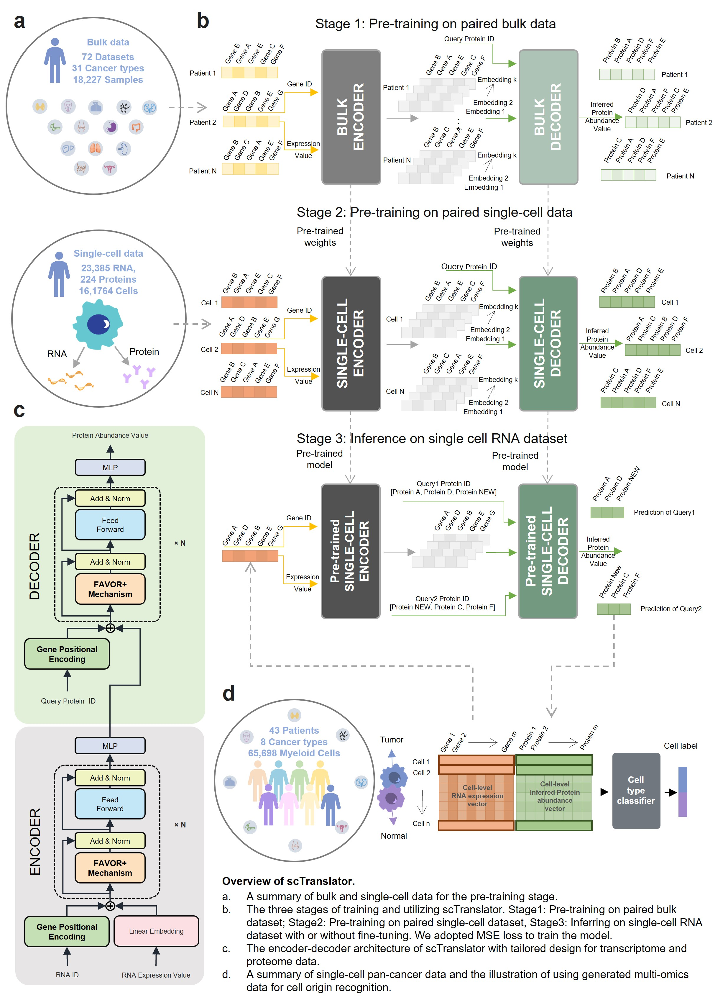

# scTranslator: A pre-trained large generative model for translating single-cell transcriptome to proteome

Despite the recent advancements in single-cell proteome technology, it still has limitation on throughput, proteome depth and batch effect and the cost is still high. Inspired by the nature language translation and the central dogma of molecular biology, we propose a pre-trained large generative model named scTranslator (single-cell translator), which is align-free and generates absent single-cell proteome by inferring from the transcriptome.



# Dataset
The data can be downloaded from this link. If you have any question, please contact elainelliu@tencent.com.

https://drive.google.com/drive/folders/1XmdKikkG3g0yl1vKmY9lhru_78Nc0NMk?usp=sharing

# Pre-trained model 
The pre-trained models can be downloaded from these links. If you have any question, please contact elainelliu@tencent.com.

| Model name                | Description                                             | Download                                                                                     |
| :------------------------ | :------------------------------------------------------ | :------------------------------------------------------------------------------------------- |
| scTranslator 2M | Pretrained on over 2 million human cells and 18,000 bulk samples. | [link](https://drive.google.com/file/d/11FR3nebhJKAt_QIng35H-O1s_-ZrKyCG/view?usp=sharing) |
| scTranslator 160k | Pretrained on over 160K human PBMCs and 18,000 bulk samples. | [link](https://drive.google.com/file/d/1nmYIsctfMD60DxOKKQc9-AQj2Wla24m8/view?usp=sharing) |
| scTranslator 10k | Pretrained on over 18,000 bulk samples.                 | [link](https://drive.google.com/file/d/14D6hFCcMrrkpo7zW90WmH3FFOR-iyIZ-/view?usp=sharing) |


# Results 
The results for analysis with jupyter demo can be downloaded from this link. If you have any question, please contact elainelliu@tencent.com.

https://drive.google.com/drive/folders/1R4JEJjwP27yLqYMlOulmvGiocnlJZT3Z?usp=sharing

# Installation
[](https://www.python.org/)
[](https://github.com/scipy/scipy) [](https://github.com/pytorch/pytorch) [](https://github.com/numpy/numpy) [](https://github.com/pandas-dev/pandas) [](https://github.com/theislab/scanpy) [](https://github.com/scikit-learn/scikit-learn)
[](https://fast-transformers.github.io/)

## 1. Environment preparation
The environment for scTranslator can be obtained from the Docker Hub registry or by installing the dependencies with requirement.txt.
### Option 1: Download the docker image from Docker Hub.
```bash
$ docker pull linjingliu/sctranslator:latest
```
Start a container based on the image and ativate the enviroment .
```bash
$ docker run --name sctranslator --gpus all -it --rm linjingliu/sctranslator:latest /bin/bash
```
### Option 2: Utilize conda to create and activate a environment.
```bash
$ conda create performer
$ conda activate performer
```
Install the necessary dependencies
```bash
$ conda install requirements.txt
```
## 2. Install by git clone
This usually takes 5 seconds on a normal desktop computer.

```bash
$ git clone git@github.com:TencentAILabHealthcare/scTranslator.git
```
Download datasets and checkpoint from provided links and place to the corresponding folder in scTranslator.

# Step by step tutorial
1. Activate the environment and switch to scTranslator folder.
    ```bash
    $ conda activate performer
    $ cd scTranslator
    ```
1. Input file format.

    scTranslator accepts single-cell data in .h5ad format as input. If you want to fine-tune the model, you need to provide scRNA.h5ad paired with scProtein.h5ad. If you want to perform inference directly, you only need to provide your query protein names in scProtein.h5ad and leave the values as 0.

1. ID convert from HUGO symbol/Entrez ID/mouse gene symbol/mouse gene ID to scTranslator ID.

    If you want to use scTranslator with your own data, you need to convert gene symbols or IDs to scTranslator IDs. Here, we provide an example. The data after gene mapping is stored in the same directory as the original data and is distinguished by the suffix '_mapped'.

    ```bash
    $ python code/model/data_preprocessing_ID_convert.py \
    --origin_gene_type='mouse_gene_symbol' \
    --origin_gene_column='index' \
    --data_path='dataset/test/cite-seq_mouse/spleen_lymph_111.h5ad'
    ```

    Parameter               |Description                 | Default 
    ------------------------|----------------------------| ----------------------------------------------
    origin_gene_column |If gene information is in the index column of anndata.var, use 'index'. If it's in a specific column, provide the column name, such as 'gene_name'. |'index'
    origin_gene_type   |Original gene type before mapping|choices=['mouse_gene_ID', 'mouse_gene_symbol', 'human_gene_symbol', 'EntrezID']
    data_path          |dataset path                     |'dataset/test/cite-seq_mouse/spleen_lymph_111.h5ad'

    
    

1. Demo for protein abundance prediction with or without fine-tuning. The results, comprising both protein abundance and performance metrics, are stored in the 'scTranslator/result/test' directory.
    ```bash
    # Inferrence without fine-tune
    $ python code/main_scripts/stage3_inference_without_finetune.py \
    --pretrain_checkpoint='checkpoint/scTranslator_2M.pt' \
    --RNA_path='dataset/test/dataset1/GSM5008737_RNA_finetune_withcelltype.h5ad' \
    --Pro_path='dataset/test/dataset1/GSM5008738_protein_finetune_withcelltype.h5ad'

    # Inferrence with fine-tune
    $ python -m torch.distributed.launch --nnodes=1 --node_rank=0 --nproc_per_node 1 --master_port 23333 \
    code/main_scripts/stage3_fine-tune.py  --epoch=100 --frac_finetune_test=0.1 --fix_set \
    --pretrain_checkpoint='checkpoint/scTranslator_2M.pt' \
    --RNA_path='dataset/test/dataset1/GSM5008737_RNA_finetune_withcelltype.h5ad' \
    --Pro_path='dataset/test/dataset1/GSM5008738_protein_finetune_withcelltype.h5ad'
    ```
1. Demo for obtaining attention matrix. The results are stored in the 'scTranslatorresult/fig5/a' directory.
    ```bash
    $ python code/downstream_application/attention_matrix.py \
    --pretrain_checkpoint='checkpoint/Dataset1_fine-tuned_scTranslator.pt' \
    --RNA_path='dataset/test/dataset1/GSM5008737_RNA_finetune_withcelltype.h5ad' \
    --Pro_path='dataset/test/dataset1/GSM5008738_protein_finetune_withcelltype.h5ad'
    ```
1. Demo for pseudo-knockout gene.he results are stored in the 'scTranslatorresult/fig5/e' directory.
    ```bashs
    # Compute origin protein abundance
    $ python code/downstream_application/pseudo_knockout_gene.py --gene='org'
    # Compute protein abundance after pseudo-knockout gene
    $ python code/downstream_application/pseudo_knockout_gene.py --gene='TP53' 
    ```
# Hyperparameters

Hyperparameter           |Description                        | Default 
-------------------------|-----------------------------------| -----------
batch_size               |Batch_size                         |8 
epoch                    |Training epochs                    |100


# Results analysis
The  [scripts](./code/visualization) for results analysis and visualization are provided.

# Time cost
The anticipated runtime for inferring 1000 proteins in 100 cells is approximately 20 seconds using a 16GB GPU and 110 seconds with a CPU.

# Disclaimer
This tool is for research purpose and not approved for clinical use.

This is not an official Tencent product.

# Coypright
This tool is developed in Tencent AI Lab.

The copyright holder for this project is Tencent AI Lab.

All rights reserved.
