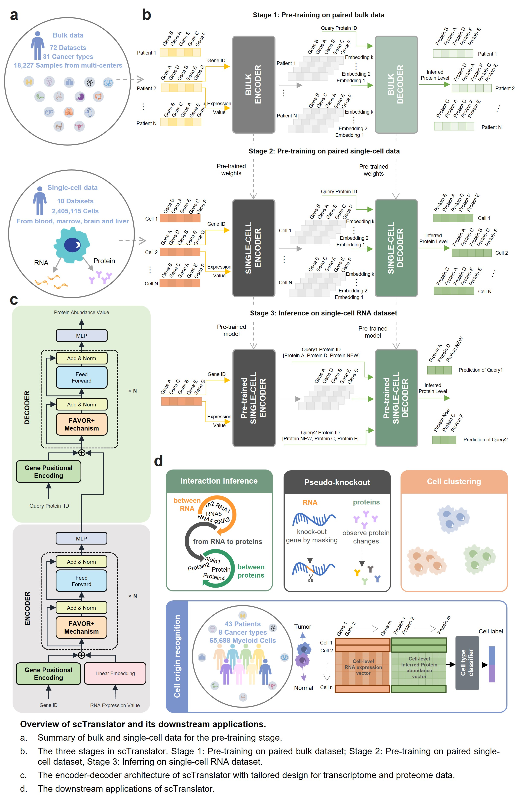

# scTranslator: A pre-trained large language model for translating single-cell transcriptome to proteome

Despite the recent advancements in single-cell proteome technology, it still has limitation on throughput, proteome depth and batch effect and the cost is still high. Inspired by the nature language translation and the central dogma of molecular biology, we propose a pre-trained large language model named scTranslator (single-cell translator), which is align-free and generates absent single-cell proteome by inferring from the transcriptome.



# Dataset
The data can be downloaded from this link. If you have any question, please contact elainelliu@tencent.com.

https://drive.google.com/drive/folders/1gTs9-wlKL0WhyQjSAUo0RK4FVuwwJPK9?usp=sharing

# Checkpoint 
The pre-trained model checkpoint can be downloaded from this link. If you have any question, please contact elainelliu@tencent.com.

https://drive.google.com/drive/folders/1Grd8IgVH_baN4tKUTxc0RPufVPZE8Vvp?usp=sharing

# Results 
The results for analysis with jupyter demo can be downloaded from this link. If you have any question, please contact elainelliu@tencent.com.

https://drive.google.com/drive/folders/1dcDNmRqhntJGLC-2Qu7C1eSotb7J_Hgq?usp=sharing

# Installation and Usage
[](https://www.python.org/)
[](https://github.com/scipy/scipy) [](https://github.com/pytorch/pytorch) [](https://github.com/numpy/numpy) [](https://github.com/pandas-dev/pandas) [](https://github.com/theislab/scanpy) [](https://github.com/scikit-learn/scikit-learn)
[](https://fast-transformers.github.io/)

## Environment preparation
The environment for scTranslator can be obtained from the Docker Hub registry or by installing the dependencies with requirement.txt.
### Option 1:
Download the docker image from Docker Hub.
```bash
$ docker pull linjingliu/sctranslator:latest
```
Start a container based on the image and ativate the enviroment .
```bash
$ docker run --name sctranslator --gpus all -it --rm linjingliu/sctranslator:latest /bin/bash
```
### Option 2:
Utilize conda to create and activate a environment.
```bash
$ conda create performer
$ conda activate performer
```
Install the necessary dependencies
```bash
$ conda install requirements.txt
```
## Installation
This usually takes 5 seconds on a normal desktop computer.

```bash
$ git clone git@github.com:TencentAILabHealthcare/scTranslator.git
```
Download datasets and checkpoint from provided links and place to the corresponding folder in scTranslator.

## Usage
1. Activate the environment and switch to scTranslator folder.
```bash
$ conda activate performer
$ cd scTranslator
```
2. Demo for protein abundance prediction with or without fine-tuning. The results, comprising both protein abundance and performance metrics, are stored in the 'scTranslator/result/test' directory.
```bash
# Inferrence without fine-tune
$ python code/stage3_inference_without_finetune.py \
--pretrain_checkpoint='checkpoint/stage2_single-cell_scTranslator.pt' \
--RNA_path='dataset/test/dataset1/GSM5008737_RNA_finetune_withcelltype.h5ad' \
--Pro_path='dataset/test/dataset1/GSM5008738_protein_finetune_withcelltype.h5ad'
# Inferrence with fine-tune
$ python -m torch.distributed.launch --nnodes=1 --node_rank=0 --nproc_per_node 1 --master_port 23333 \
code/stage3_fine-tune.py  --epoch=100 --frac_finetune_test=0.1 --fix_set \
--pretrain_checkpoint='checkpoint/stage2_single-cell_scTranslator.pt' \
--RNA_path='dataset/test/dataset1/GSM5008737_RNA_finetune_withcelltype.h5ad' \
--Pro_path='dataset/test/dataset1/GSM5008738_protein_finetune_withcelltype.h5ad'
```
3. Demo for obtaining attention matrix.
```bash
$ python code/attention_matrix.py \
--pretrain_checkpoint='checkpoint/Dataset1_fine-tuned_scTranslator.pt' \
--RNA_path='dataset/test/dataset1/GSM5008737_RNA_finetune_withcelltype.h5ad' \
--Pro_path='dataset/test/dataset1/GSM5008738_protein_finetune_withcelltype.h5ad'
```
4. Demo for pseudo-knockout gene.
```bash
# Compute origin protein abundance
$ python code/pseudo_knockout_gene.py --gene='org'
# Compute protein abundance after pseudo-knockout gene
$ python code/pseudo_knockout_gene.py --gene='TP53' 
```

# Time cost
The anticipated runtime for inferring 1000 proteins in 100 cells is approximately 20 seconds using a 16GB GPU and 110 seconds with a CPU.

# Disclaimer
This tool is for research purpose and not approved for clinical use.

This is not an official Tencent product.

# Coypright
This tool is developed in Tencent AI Lab.

The copyright holder for this project is Tencent AI Lab.

All rights reserved.